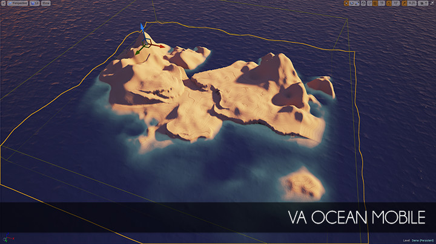

Overview
========

**VaOceanMobile** is the content project with ocean shader created for **mobile** games on [Unreal Engine 4](https://www.unrealengine.com/). Yes, exactly! It looks the same on mobile and works **really** fast!

Tested both on iOS and Android devices :)

Sure, this ocean shader has limited set of features in comparsion to desktop alternatives, but the key goal was achieved - it's fast, nice-looking for topdown view and works on mobile devices and web.

Current version: **1.0 R 2** (tested for UE 4.9-4.24)

Documentation: http://bit.ly/VaOceanMobile-Docs

Legal info
----------

Unreal® is a trademark or registered trademark of Epic Games, Inc. in the United States of America and elsewhere.

Unreal® Engine, Copyright 1998 – 2014, Epic Games, Inc. All rights reserved.
